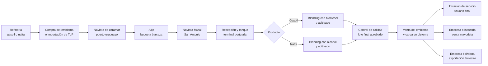

# Esquema de trazabilidad del sistema de combustibles

Fuente: *Unidad 2 - Cadena de Valor del Negocio - Práctica Analítica - Caso 2.pdf*, páginas 1–2. El caso describe la cadena física y solicita **proponer** un sistema de codificación; no establece códigos ni registros existentes. En este documento, los identificadores, eventos y reglas de seguimiento son una **propuesta analítica**.

## Recorrido y puntos de registro

TLP representa una **alternativa comercial** en la etapa de importación: importa y vende a un emblema según la demanda. El lote igualmente debe vincularse con su recepción, eventual formulación y despacho. El caso no precisa en qué punto ocurre esa venta; el vínculo de registros debe documentar el punto real cuando se conozca.

| Etapa del caso | Identificador o evento propuesto | Datos mínimos para reconstruir el recorrido |
| --- | --- | --- |
| Refinería y compra | Lote de origen; orden de compra | Refinería, producto, grado declarado, cantidad, fecha, emblema importador o TLP |
| Transporte marítimo y alije | Eventos de carga y transferencia | Lote de origen, buque, puerto uruguayo, fecha, cantidad transferida, barcaza receptora |
| Transporte fluvial y recepción | Evento de llegada; lote recibido | Barcaza, terminal de San Antonio, fecha, tanque, cantidad recibida, lote de origen asociado |
| Blending y aditivado | Orden de formulación; lote resultante | Lotes y cantidades de gasoil/nafta, biodiesel o alcohol, aditivos, fórmula aplicada, tanque y fecha |
| Control de calidad | Ensayo y decisión de liberación | Lote resultante, tipo de gasoil o RON de nafta, resultado, fecha, responsable y condición de liberación |
| Venta y distribución | Eventos de carga y entrega | Lote liberado, cantidad, cisterna, emblema, fecha, destino: estación, empresa/industria o empresa boliviana |

## Código de lote propuesto

`[EMB]-[PROD]-[GRADO]-[AAAAMMDD]-[TER]-[TQ]-[SEC]`

Ejemplo ilustrativo: `EMB-NAF-R95-20260915-SAN-T12-0042`. `EMB` identifica al emblema responsable; `PROD` distingue gasoil (`GAS`) y nafta (`NAF`); `GRADO` distingue Tipo I/III o RON 85/90/95/97; `TER` y `TQ` ubican terminal y tanque; `SEC` evita duplicados del mismo día. Los valores del ejemplo son ficticios. El código identifica **el lote final**, mientras que el registro enlazado conserva los lotes de origen y cada movimiento. Si una formulación mezcla varios lotes, todos quedan como padres del lote resultante; si el lote se divide entre varias cisternas, cada despacho conserva el mismo lote padre y su cantidad.

## Consulta en ambos sentidos

- **Hacia adelante:** desde un lote de refinería o de insumo, identificar qué formulaciones lo utilizaron, qué productos finales se liberaron y a qué cisternas y destinos se entregaron.
- **Hacia atrás:** desde una estación, industria o entrega boliviana, recuperar cisterna, lote final, ensayo, fórmula, tanque, barcaza, buque y lote de refinería.
- **Control y retroalimentación propuestos:** un resultado de calidad que no permita liberar el lote vuelve a formulación o retiene el despacho. Una observación posterior de mercado o de los órganos reguladores MIC e INTN se asocia a los lotes afectados para investigar el origen y las entregas.

El caso incluye GLP y petroquímicos entre los productos de refinería, pero detalla importación, formulación y distribución posteriores solo para gasoil y nafta. Por eso, el recorrido trazado aquí se limita a esos dos combustibles.
